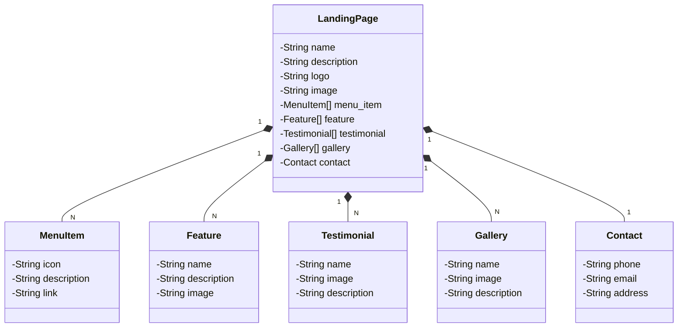

# RESTful API com Deploy na Nuvem

## Domínio: LandingPage

API para registro e recuperação de informações para compor LandingPages

## Principais Tecnologias
 - Java 17
 - Spring Boot 3
 - Spring Data JPA
 - OpenAPI (Swagger)
 - Railway

## Diagrama de Classes

